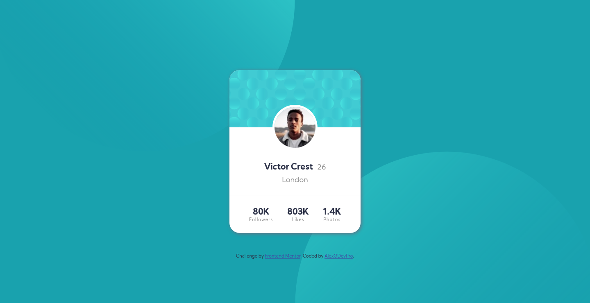
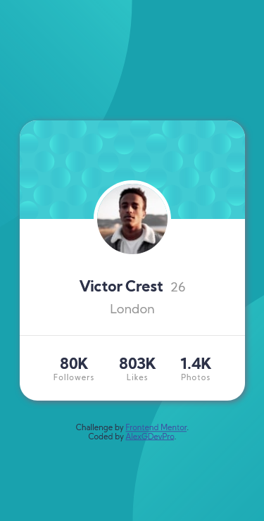

# Frontend Mentor - Profile card component solution

This is a solution to the [Profile card component challenge on Frontend Mentor](https://www.frontendmentor.io/challenges/profile-card-component-cfArpWshJ). Frontend Mentor challenges help you improve your coding skills by building realistic projects. 

## Table of contents

- [Overview](#overview)
  - [The challenge](#the-challenge)
  - [Screenshot](#screenshot)
  - [Links](#links)
- [My process](#my-process)
  - [Built with](#built-with)
  - [What I learned](#what-i-learned)
- [Author](#author)


## Overview

### The challenge

- Build out the project to the designs provided

### Screenshot
- Desktop view:



- Mobile view:




### Links

- Solution URL: [Add solution URL here](https://your-solution-url.com)
- Live Site URL: [Add live site URL here](https://your-live-site-url.com)

## My process

### Built with

- Semantic HTML5 markup
- CSS custom properties
- Flexbox
- Mobile-first workflow

### What I learned

During this challenge I encountered an issue with the background image continuously moving while resizing Windows.
I learned how to use the vh and vw units.
Things I've never used before.
Thanks to this, no need for Media Queries to redo the background for desktop version.

```css
body {
    background: 
        url('../images/bg-pattern-top.svg') no-repeat right 50vw top -50vh,
        url('../images/bg-pattern-bottom.svg')  no-repeat left 50vw top 50vh,
        var(--dark-cyan);
    background-size: 100vh;
}
```

## Author

- Website - [Alex G](https://alexgdevpro.github.io/)
- Frontend Mentor - [@AlexGDevPro](https://www.frontendmentor.io/profile/AlexGDevPro)
- Twitter - [@AlexGDevPro](https://twitter.com/AlexGDevPro)
